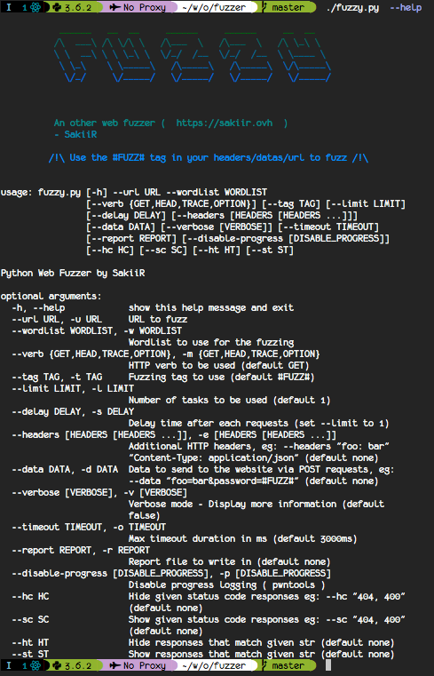

# Fuzzy !

An other python web fuzzer.

It is used to test website URLs with a wordlist.

## TL;DR

```
Fuzzing or fuzz testing is an automated software testing technique that involves providing invalid, unexpected, or random data as inputs to a computer program.
The program is then monitored for exceptions such as crashes, or failing built-in code assertions or for finding potential memory leaks.
Typically, fuzzers are used to test programs that take structured inputs. This structure is specified, e.g., in a file format or protocol and distinguishes valid from invalid input.
An effective fuzzer generates semi-valid inputs that are "valid enough" in that they are not directly rejected by the parser, but do create unexpected behaviors deeper in the program and are "invalid enough" to expose corner cases that have not been properly dealt with.
- Wikipedia
```

## Usage


